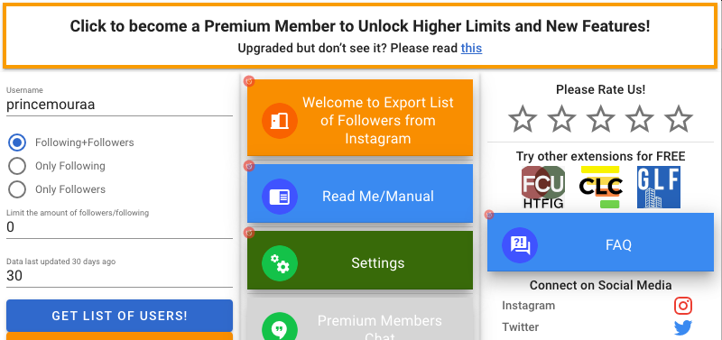
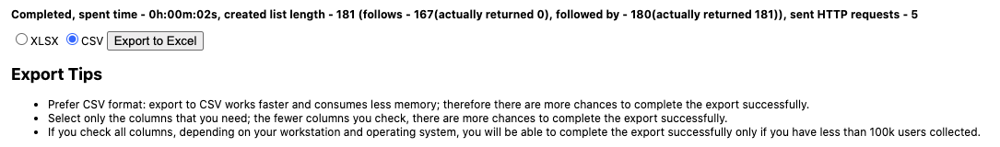

## About
We've all been there. You notice you lost a follower and curiosity is building up. Who did it and why? Well the code can tell you who, the why is up to you to figure out.

The code won't ask you for your username or password. That's actually the benefit of using it and why I built it. Third party apps require sensitive information such as your username and password. Your credentials can be sold to the highest bidder without you knowing so guess what. I found the work around.

## Prerequisites
The application uses a third party extension that downloads a list of instagram followers.

You can download the third party extension here: https://chrome.google.com/webstore/detail/export-list-of-followers/hcdbfckhdcpepllecbkaaojfgipnpbpb?hl=en-US

Be advised of their policies as they may or may not store your account information just like the apps. Remember the workaround I talked about earlier? Just in case, you can create a secondary instagram account so they do not have access to any personal information. If you create a secondary instagram account, make sure that account follows the account you actually want to export followers from. (That is how the extension works. If you want to export a list of followers, it must be the account you are logged on to or an account you follow)

## Be Aware!

#### NOTICE 1:
If a user changes their name, the old username will show as someone who no longer follows you but in reality, they just changed their username! The new 'original' file will be updated with the newest username.

#### NOTICE 2:
Make sure you select the correct download file. Notice how it automatically selects "following + followers?" Make sure to change that to "only followers." Afterwards, click 'Get List Of Users' and a new window will appear. Click 'Export to Excel'. Follow the screenshots! After you have followed the screenshots, just run the code and you'll know who unfollowed.

&nbsp;
&nbsp;
&nbsp;
&nbsp;
#### The New Window:

## Errors
* `"Exception in thread "main" java.io.FileNotFoundException: afterwards.csv (Is a directory)"` :

1: Make sure you downloaded the "only followers" list and not the "following + followers" list. 

You can check by going to your downloads folder and reading the name of the file you downloaded. If you downloaded the correct file name, it should begin with "followed_by_user". If you downloaded the latter, it will begin with "All_users." Please read 'how to fix the error' below.

2: If you run the code without downloading the download file, (note that when you run the code the download file gets deleted), you will get the error above. Please read 'how to fix the error' below.

### HOW TO FIX THE ERROR
If you downloaded the incorrect file by accident or run the code without the file being present, no worries. A file named 'afterwards' will be created in the directory you downloaded the code in and you will have to delete it to continue. After you have deleted the file, download the correct file (check screenshot above) and run the code again.
